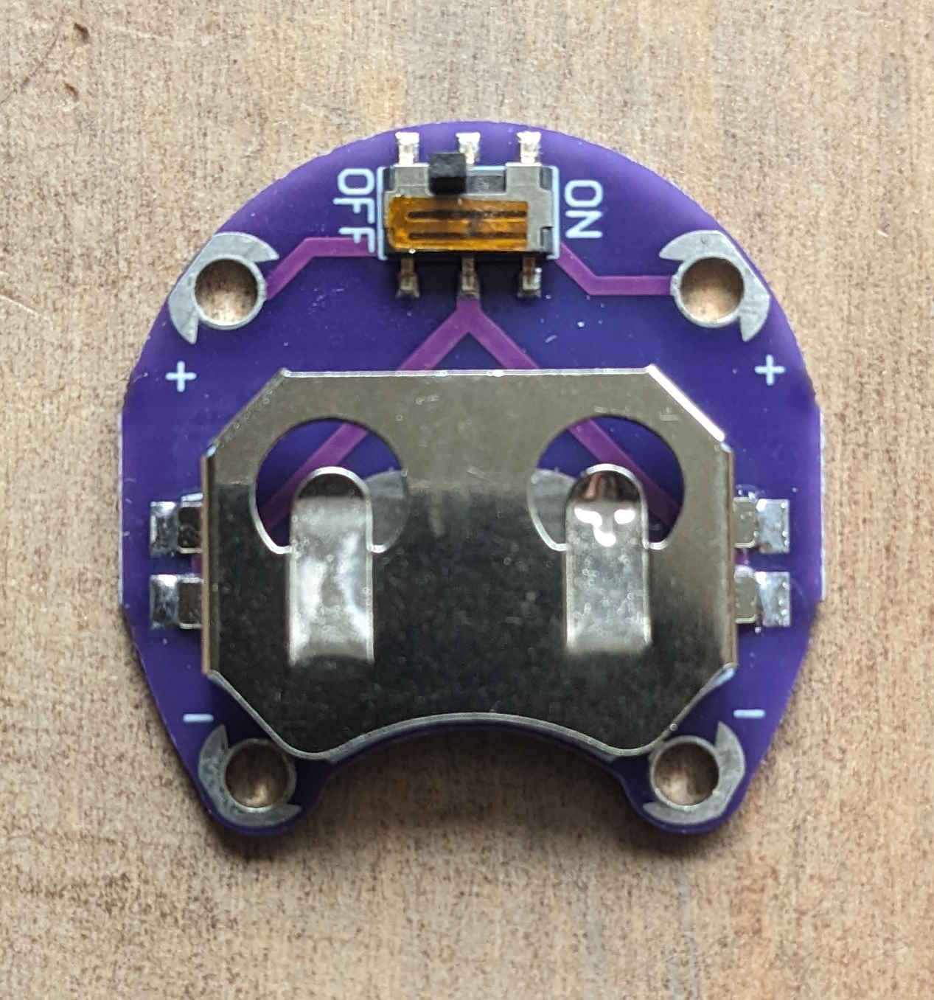
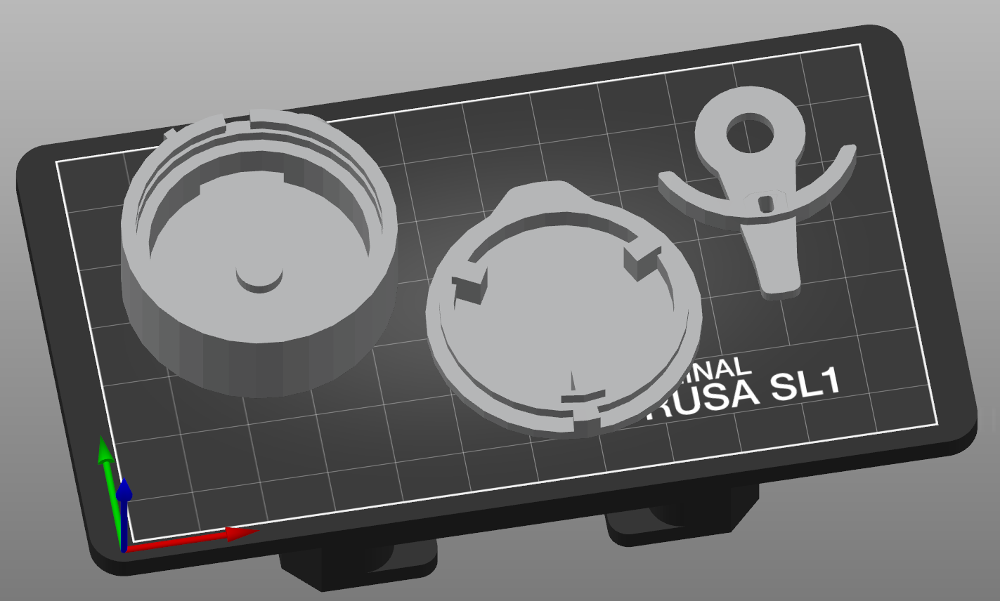
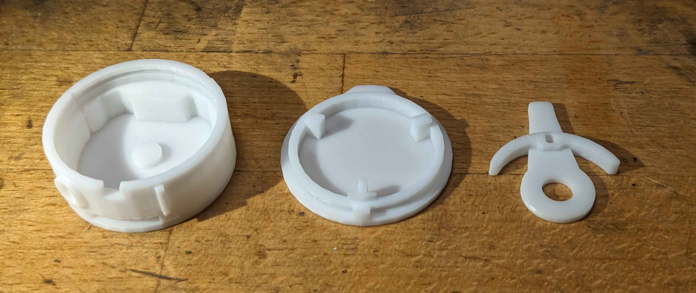
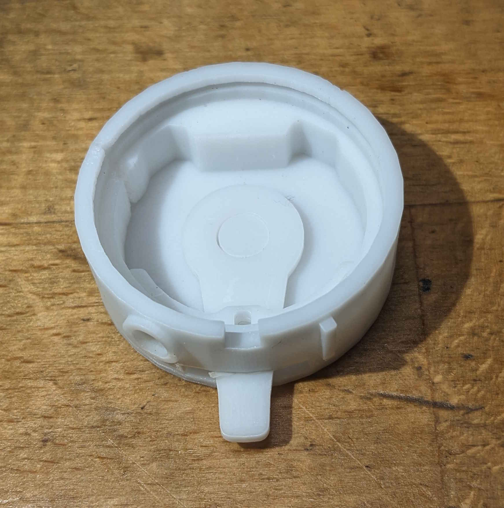
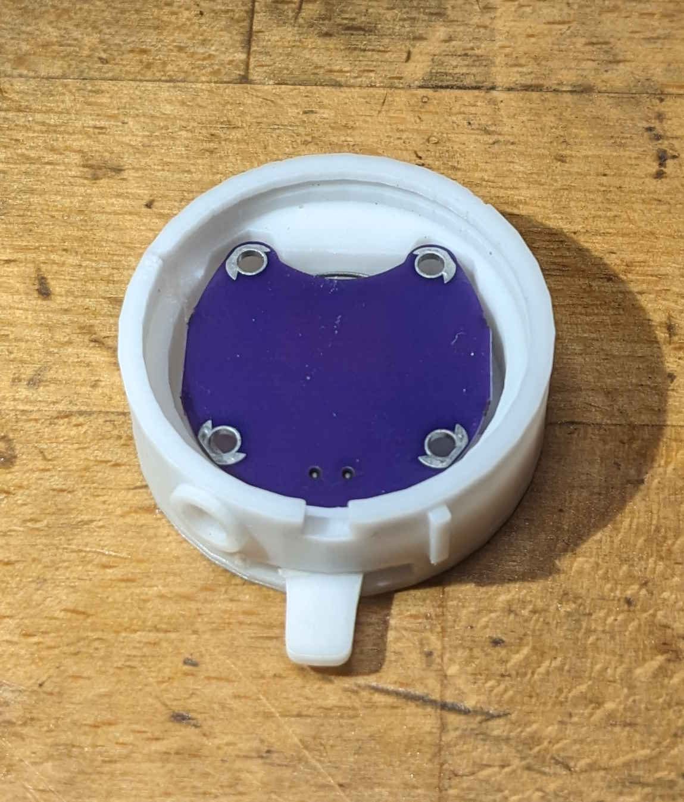
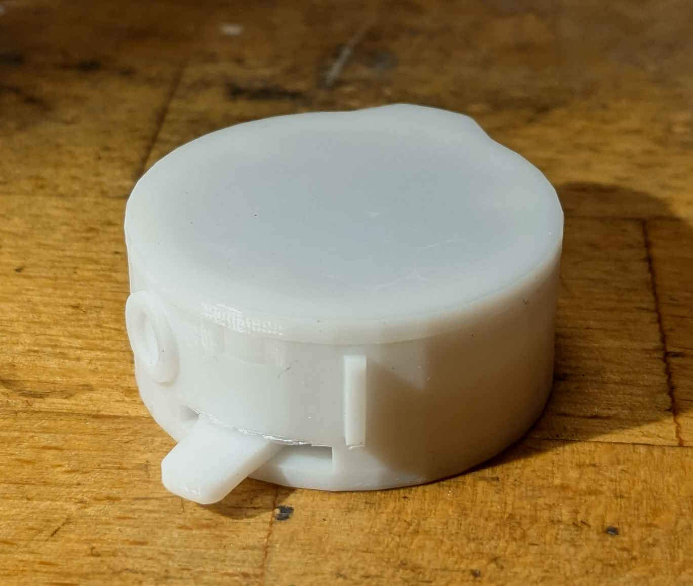

This repo contains a 3D-printable case for a "lilypad" CR2032-battery-holder-with-switch, e.g. this one from [eBay](https://www.ebay.co.uk/itm/146675695314):

The lever slides into the slot in the body from the inside, the lilypad CR2032 board drops in on top, with the switch/battery facing downwards and the toggle of the switch engaging in the hole in the lever so that the lever can be used to operate the switch while the board is in the case.  A push-on cap goes on top.

The intention is that the lid, and possibly the case, are modified for whatever application the board is put to, assuming your components are placed on top (i.e. on the back of the lilypad CR2032 board).  If you do this in Blender, export the `.stl` for printing with the default Blender scale factor of 1.

Print on a resin printer using normal (e.g. 0.05&nbsp;mm) resolution and no pads or supports for a nice clean look; you may end up with a little loose material on the body around the top of the switch slot, which can be removed after washing/curing with a scalpel.  Printing should take less than an hour.

Here is an example printed in an ASA-like resin:

It _may_ be possible to print this on an FDM printer, I haven't tried: you would need supports everywhere, a high resolution (e.g. 0.1&nbsp;mm) and you might choose an ASA filament for UV safety.